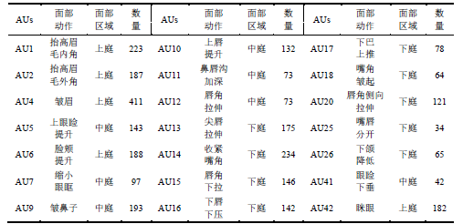
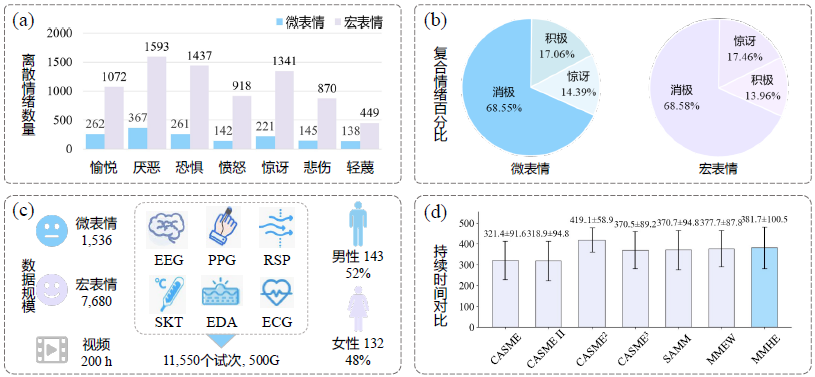
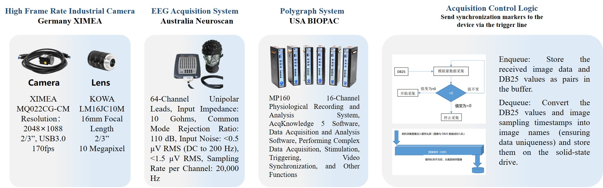
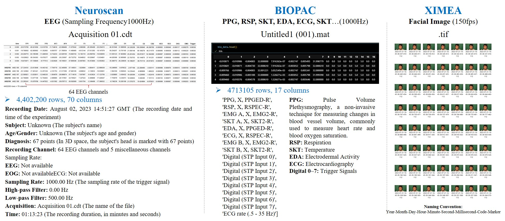

# MMHE: A multimodal hidden-emotion dataset that integrates facial micro-expressions, EEG, and multiple peripheral physiological signals

# Abstract

To mitigate the difficulty of representing the multidimensional and dynamic processes of hidden emotions under data scarcity and single-modality constraints, we construct a multimodal dataset that integrates facial micro-expressions, electroencephalography (EEG), and multiple peripheral physiological signals. A diverse library of emotion-eliciting materials is designed following the canonical pattern of “externally controlled facial suppression with passive activation of internal physiological channels,” thereby enhancing the ecological validity of the “emotion elicitation‒expression suppression” paradigm through simulated social evaluative pressure. Based on the Facial Action Coding System (FACS), multiple experts perform independent annotations with cross-validation to ensure labeling accuracy and consistency. The dataset comprises 275 participants, including 1,536 micro-expression samples, 7,680 macro-expression samples, and 11,550 multimodal physiological trials, supporting dynamic cross-modal analysis of hidden emotions. Leveraging these multidimensional dynamics, we further develop baseline recognition models for both visual single-modality and multimodal fusion scenarios. In a three-class compound emotion task, the best model achieves an accuracy of 79.46%, validating the dataset’s effectiveness. This work thus provides a solid data foundation for subsequent research on micro-expression spatiotemporal representation and multimodal fusion modeling.

# Experimental setup and signal examples of the MMHE dataset acquisition system

The experimental setup, as illustrated in the left panel of Fig. 1, was conducted in a controlled environment. To eliminate 50 Hz AC-induced flickering, we implemented a specialized lighting system consisting of three 600-watt DC-powered LED lights equipped with umbrella reflectors. These lights were strategically positioned to focus illumination on the participant's face, ensuring consistent and high-intensity lighting conditions. Specifically, the lighting configuration comprised one central light positioned directly in front of the participant and two additional lights placed at 45 angles to the left and right of the participant. Participants were seated one meter from the main display monitor, with a green background panel positioned behind them to facilitate subsequent facial image processing.

The list of AU codes involved in MEs in the MMHE dataset, along with their corresponding action descriptions, occurrence regions, and counts is shown in Table 1.

In this section, we perform a statistical analysis of the annotated samples. The results, presented in Fig. 2, highlight four key characteristics: (a) the distribution of seven basic discrete emotions; (b) the distribution of three composite emotions ("Negative," "Positive," and "Surprise"); (c) the dataset size and participant gender composition; and (d) a comparison of mean ME durations and their standard deviations across benchmark datasets. 

# Samples of micro-expressions labeled with each emotion

The following animated images are samples of micro-expressions labeled with each emotion:

# Experimental equipment description

The Experimental equipment description and data synchronization mechanism are shown in the figure below:

# Data structure

The image below illustrates the data structure of a multimodal micro-expression dataset:

# Coding file

The dataset annotation file is shown in the figure below:

# How to Apply for the Dataset

To apply for this dataset, please download the "Release Agreement.pdf" file, print it, fill in the required information by hand, and send the scanned copy to the email address: ustb_machuang@163.com.
